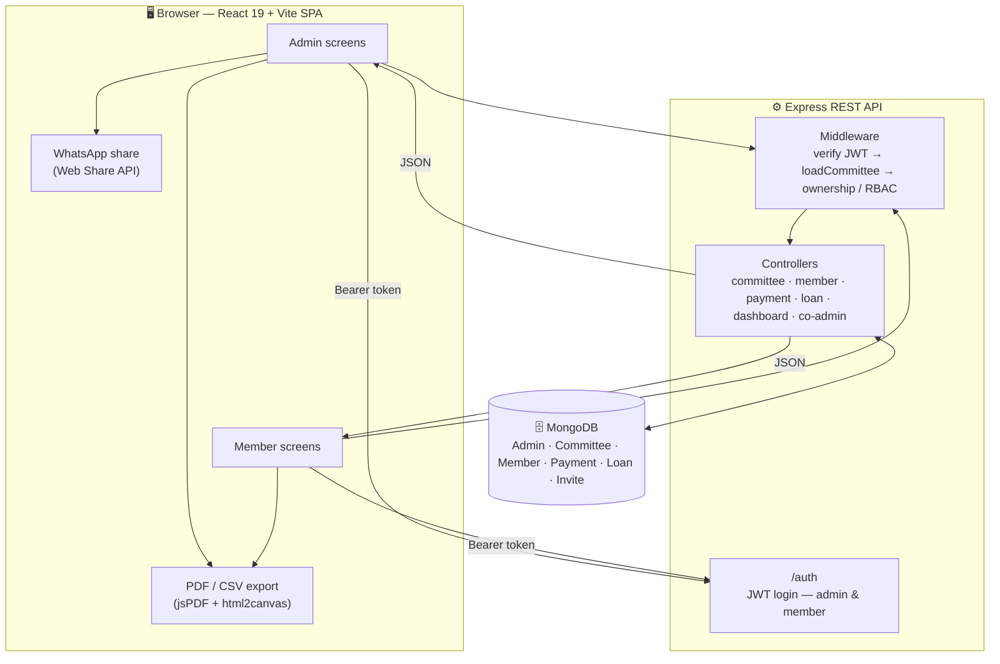

<div align="center">

<br/>

<br/>


A dual-role savings & loan management app for community committees (samitis / chit funds) — built for Admins and Members, from monthly contributions and loan tracking to bilingual PDF/CSV reports and WhatsApp sharing.
🔗 View Live Site
</div>
<br/>
📋 Table of Contents
<details>
<summary>Click to expand</summary>
Overview
Architecture
Features
Tech Stack
Screenshots
Project Structure
Getting Started
Environment Variables
API Modules
Security
Testing
Roadmap
Author
License
</details>
<br/>
🌍 Overview
Committee Management digitizes how a community savings committee (a "samiti" or chit fund) is run — tracking who has paid this month, who has an outstanding loan, and how much cash the committee actually holds, instead of a paper register. It's a dual-auth system: Admins (email + password) create and run one or more committees, while Members (committee code + phone + 4-digit PIN) log in to see their own payment and loan history.
It's built as a separate REST API (Express + MongoDB) consumed by a React SPA (Vite), with the whole interface — including generated PDF reports and receipts — available in Hindi and English.
<br/>
🏗️ Architecture

A few deliberate choices worth calling out:
Every committee-scoped request passes through the same middleware chain — verify the JWT, load the committee from the URL, then check the caller actually owns/co-manages it (admin) or is the member being requested. This is what stops one admin from reading another admin's committee data.
PDF and CSV generation happen entirely in the browser, not on the server — the report is built as real HTML and rasterized client-side (via `html2canvas`) before being placed into a PDF with `jsPDF`. This is what makes Hindi text render correctly instead of the overlapping-glyph corruption you get from a server-side library drawing Devanagari with a Latin-only font.
WhatsApp sharing uses the browser's native Web Share API to hand the generated PDF file to WhatsApp directly on mobile, falling back to a download + pre-filled `wa.me` link on desktop, where file-sharing via a link isn't possible.
<br/>
✨ Features
<table>
<tr>
<td width="50%" valign="top">
🔐 Dual-Role Access Control
Two distinct identities — Admin and Member — with separate JWT-based login flows
Route-level ownership checks: an admin can only see committees they own or co-manage; a member can only see their own records
Optional shared-secret gate on admin registration, per-committee join codes for members
🏦 Multi-Committee Support
One admin can create and run several independent committees
Invite-based co-admin system per committee
Owner-only actions (delete committee, manage co-admins) vs. shared admin actions
💰 Payments
A month-by-month grid per member, per committee
Bulk "mark all as paid" for the committee's default monthly amount
Auto-generated, shareable receipts
</td>
<td width="50%" valign="top">
💸 Loans
Principal + flat interest rate, calculated automatically (per committee default or per loan)
Member-initiated loan requests, with admin approve/reject
Repayment tracking that auto-closes (and correctly reopens) a loan based on principal + interest due, not just principal
📊 Dashboard
Role-specific summaries: total collected, total loaned, outstanding (interest-inclusive), balance in hand
Only counts disbursed (active/closed) loans — pending or rejected loan requests never inflate the numbers
📄 Reports & Sharing
Full committee PDF report (payment register + loan ledger + summary), rendered via HTML→canvas so Hindi text never breaks
CSV export with fully localized column headers
Direct WhatsApp share via the Web Share API, with a download-and-attach fallback on desktop
🌐 Hindi / English i18n
Every screen, PDF, and CSV column follows the selected language
</td>
</tr>
</table>
<br/>
🛠️ Tech Stack
<div align="center">

</div>
Layer	Tools
Frontend	React 19, Vite
PDF / Export	jsPDF, html2canvas
Icons	lucide-react
Backend	Node.js, Express 4
Database / ODM	MongoDB, Mongoose
Auth	JWT, bcryptjs
Security	Helmet, CORS, express-rate-limit
Testing	Jest, Supertest, mongodb-memory-server
Deployment	Vercel (frontend), Node host of your choice (backend)
<br/>
📸 Screenshots
<div align="center">
<table>
<tr>
<td align="center" width="25%"><b>Role Choice</b></td>
<td align="center" width="25%"><b>Admin Dashboard</b></td>
<td align="center" width="25%"><b>Payments Grid</b></td>
<td align="center" width="25%"><b>Loans</b></td>
</tr>
<tr>
<td></td>
<td></td>
<td></td>
<td></td>
</tr>
</table>
<sub>Add your own screenshots to a <code>screenshots/</code> folder — the filenames above are placeholders.</sub>
</div>
<br/>
📁 Project Structure
```
committee-mgmt/
├── backend/
│   ├── server.js                 # Entry point — connects DB, starts listener
│   ├── app.js                    # Builds the Express app (no side effects — used by tests too)
│   ├── config/                   # DB connection
│   ├── controllers/               # Route handler logic (auth, committee, member,
│   │                                payment, loan, dashboard, co-admin, pin-reset)
│   ├── middleware/                # auth (JWT), committeeAccess (ownership/RBAC),
│   │                                rateLimiter, errorHandler
│   ├── models/                    # Mongoose schemas (Admin, Committee, Member,
│   │                                Payment, Loan, CommitteeInvite, PinResetRequest)
│   ├── routes/                    # Express routers
│   ├── tests/                     # Jest + Supertest integration tests
│   └── seed.js                    # First-time admin bootstrap
│
└── frontend/
    ├── src/
    │   ├── api/                   # fetch wrapper (apiRequest)
    │   ├── components/            # Layout, modals (Receipt/Statement), Toast, ConfirmDialog
    │   ├── i18n/                  # translations.js (en/hi) + I18nContext
    │   ├── pages/                 # Onboarding, MemberLogin, Dashboard, Members,
    │   │                            Payments, Loans, Settings
    │   ├── hooks/                  # useIdleLogout (auto-logout on a shared device)
    │   ├── utils/                  # session persistence, csv/pdf export, reportPdf
    │   └── styles/                 # design tokens (colors, fonts)
    └── public/
```
<br/>
🚀 Getting Started
Prerequisites
Node.js 18+
A MongoDB Atlas cluster (or a local MongoDB instance)
Installation
```bash
git clone <your-repo-url>
cd committee-mgmt
```
Backend
```bash
cd backend
npm install
```
Frontend
```bash
cd frontend
npm install
```
Environment Variables
`backend/.env`
```env
# MongoDB connection string
MONGO_URI=mongodb://127.0.0.1:27017/committee_db

# Server port
PORT=5000

# JWT secret — use a long random string in production
JWT_SECRET=replace_this_with_a_long_random_secret
JWT_EXPIRES_IN=7d

# First-time admin bootstrap (used only by npm run seed)
ADMIN_NAME=Admin
ADMIN_EMAIL=admin@example.com
ADMIN_PASSWORD=azad123

# Anyone who knows this secret can register as a new admin. Set it to a
# long random value in production; leave blank to keep registration open
# (local testing only).
ADMIN_REGISTRATION_SECRET=replace_with_a_long_random_secret

# Comma-separated frontend origins allowed to call this API.
# Leave blank in local development to allow all origins.
CORS_ORIGIN=
```
`frontend/.env`
```env
VITE_API_BASE_URL=http://localhost:5000/api
```
Run locally
Backend
```bash
cd backend
npm run dev
```
Frontend (in a separate terminal)
```bash
cd frontend
npm run dev
```
Bootstrap the first admin account (reads `ADMIN_NAME` / `ADMIN_EMAIL` / `ADMIN_PASSWORD` from `backend/.env`):
```bash
cd backend
npm run seed
```
<br/>
🔌 API Modules
All routes are prefixed with `/api`. Committee-scoped routes nest under `/api/committees/:committeeId/...` and load that committee via middleware before any handler runs.
<details>
<summary><b>View all modules</b></summary>
<br/>
Base Route	Resource	Access
`/auth/admin/register`, `/auth/admin/login`	Admin registration & login	Public (registration may require a shared secret)
`/auth/member/login`	Member login (committee code + phone + PIN)	Public
`/auth/me`	Current user info	Authenticated
`/committees`	Create committee, list my committees	Admin
`/committees/:id`	Get / update / delete a committee	Admin (owner for delete)
`/committees/:id/invites`	Create / list / revoke co-admin invites	Owner
`/committees/invites/redeem`	Redeem a co-admin invite code	Admin
`/committees/:id/co-admins/:adminId`	Remove a co-admin	Owner
`/committees/:id/export`	Full committee data backup (JSON)	Admin
`/committees/:id/members`	List / create members	Admin
`/committees/:id/members/:id`	Get / update / delete a member	Admin, or the member themself (get only)
`/committees/:id/members/me/pin`, `/me/profile`	Member self-service (change PIN, update profile)	Member
`/committees/:id/pin-reset-request`	Request a PIN reset	Public (rate-limited)
`/pin-reset-requests`	List / approve / reject PIN reset requests	Admin
`/committees/:id/payments`	List / record payments	Admin
`/committees/:id/payments/member/:memberId`	A member's payment history	Admin, or that member
`/committees/:id/loans`	List / create loans	Admin
`/committees/:id/loans/request`	Request a loan	Member
`/committees/:id/loans/:id/approve`, `/reject`	Approve / reject a loan request	Admin
`/committees/:id/loans/member/:memberId`	A member's loan history	Admin, or that member
`/committees/:id/dashboard/summary`	Financial summary	Admin or Member (different shapes)
</details>
<br/>
🔒 Security
Passwords hashed with bcryptjs; member PINs are hashed the same way, never returned in queries
JWT bearer tokens for both admin and member sessions, with a configurable expiry
Helmet for secure HTTP headers, CORS locked to configured frontend origins
express-rate-limit on registration, login, and PIN-reset-request endpoints
Fine-grained ownership checks (`isOwnerOrCoAdmin`) on every committee-scoped route — an admin who doesn't own or co-manage a committee cannot read its members, payments, or loans, even with a valid token
Auto-logout after 20 minutes of inactivity on the frontend (this is often used on a shared family device), with the idle countdown resuming correctly across a page refresh instead of resetting
<br/>
🧪 Testing
Backend integration tests run against an in-memory MongoDB (via `mongodb-memory-server`), so they need no real database and no network access.
```bash
cd backend
npm test
```
Coverage includes admin/member auth, cross-committee access control (the ownership checks above), loan interest calculation and status transitions, and dashboard summary accuracy (interest-inclusive outstanding balances, excluding pending/rejected loan requests from totals).
<br/>
🗺️ Roadmap
[ ] Partial loan repayment UI (backend already supports arbitrary repaid amounts)
[ ] Broader frontend test coverage
[ ] Loan due-date reminders (WhatsApp/notification)
[ ] Downloadable/print-friendly committee rules page for members
<br/>
👤 Author
<div align="center">
Shakibuddin
B.Tech CSE (Lateral Entry) · IES College of Technology, Bhopal

</div>
<br/>
📄 License
This project is licensed under the ISC License.
<br/>
<div align="center">
If you found this project useful, consider giving it a ⭐ on GitHub!

</div>