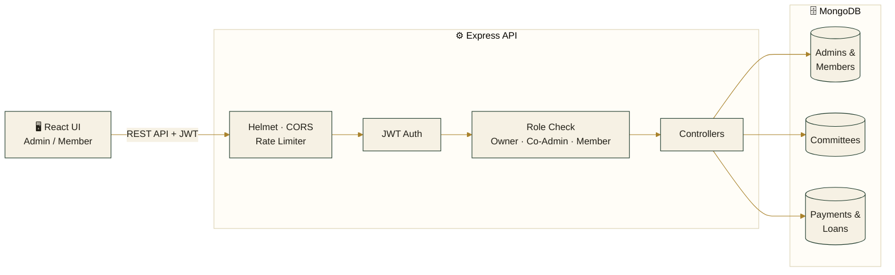
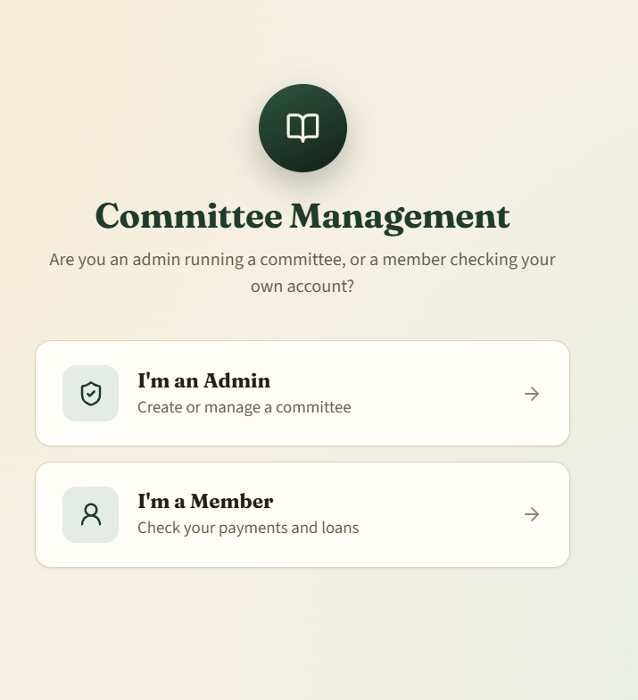

<div align="center">

 

<br/>

[](https://committee-mgmt.vercel.app/)

<br/>


**A role-based committee savings platform** — built for Owner, Co-Admin, and Member workflows, from monthly payments and interest-bearing loans to bilingual, printable reports.

[**🔗 View Live Site**](https://committee-mgmt.vercel.app/)

</div>

<br/>

## 📋 Table of Contents

<details>
<summary>Click to expand</summary>

- [Overview](#-overview)
- [Features](#-features)
- [Architecture](#%EF%B8%8F-architecture)
- [Tech Stack](#-tech-stack)
- [Screenshots](#-screenshots)
- [Project Structure](#-project-structure)
- [Getting Started](#-getting-started)
- [Environment Variables](#-environment-variables)
- [API Modules](#-api-modules)
- [Security](#-security)
- [Roadmap](#-roadmap)
- [Author](#-author)
- [License](#-license)

</details>

<br/>

## 🌍 Overview

In India, informal savings committees (BC / chit funds / samitis) are still run on paper registers and WhatsApp groups — easy to lose, hard to audit, impossible to check from a phone at 11 PM. **Committee Management** is a full-stack ERP that replaces that register: an Owner runs the committee, an optional Co-Admin helps manage it, and Members log in with just their phone number and a 4-digit PIN — no email, no app store. Every rupee — payments, loans, interest — is tracked, searchable, and exportable, in **English or Hindi**.

It's built as a separate REST API (Express + MongoDB) consumed by a React SPA (Vite, no UI framework — a custom design-token system), with JWT auth, bcrypt-hashed credentials, and a 3-tier role check (Owner / Co-Admin / Member) enforced at the middleware level.

> ⚠️ **Note:** The backend may be on a free-tier host and can take a few seconds to wake up on the first request after inactivity.

<br/>

## ✨ Features

<table>
<tr>
<td width="50%" valign="top">

**🔐 Role-Based Access Control**
- Three roles — Owner, Co-Admin, Member — enforced with route-level middleware
- JWT auth, bcrypt-hashed PINs and passwords
- Co-Admin invites via expiring, single-use codes — without ever sharing the Owner's login
- Self-service PIN-reset request flow, reviewed and approved by an admin

**👥 Members & Payments**
- Members register with search and pagination; each gets a unique phone + PIN login
- Spreadsheet-style monthly payment grid per member, with inline editing
- One-click **"mark all paid"** for the current month
- Self-service: members can change their own PIN and edit their own phone number

**💰 Loans, With Interest**
- Admin can give loans directly, or review loan **requests** members submit themselves
- Interest calculated automatically from the committee's configured rate
- Full approve/reject workflow with status tracking (requested → active → closed)

</td>
<td width="50%" valign="top">

**📄 Bilingual Reports**
- Full payment register + loan ledger + summary, rendered as a real PDF
- Renders correctly in **Hindi** via an HTML→canvas pipeline (not a font-embedding hack that breaks on Devanagari)
- One-click share straight to **WhatsApp**, and a printable year-end statement per member

**🌐 Custom i18n Layer**
- English / Hindi toggle across the entire UI — not just labels, PDFs and CSVs export correctly in the selected language too

**📦 Data Portability**
- One-click **JSON backup export** — members, loans, and payment history
- Per-page **CSV export** for members, payments, and loans

**🔔 UX Details**
- Session **auto-logout** on inactivity, with a warning first
- Live activity + notifications, confirm-before-delete dialogs, toast feedback on every action
- Fully responsive — a proper mobile drawer nav, not a squeezed desktop layout

</td>
</tr>
</table>

<br/>

## 🏗️ Architecture

The frontend never talks to MongoDB directly — every request goes through a layered Express API: security headers and rate-limiting first, then JWT auth, then a role check (**Owner** vs **Co-Admin** vs **Member**) before it ever reaches a controller.



**Why this shape matters:** a Co-Admin can manage members and loans, but only the **Owner** can revoke an invite or delete the committee — that distinction is enforced once, in the Role Check step, not re-checked in every controller. It's also why a member's PIN-reset request has to be approved by an admin instead of resetting itself: the write path for anything security-sensitive always passes through a human on the other side of that check.

The frontend is deployed on **Vercel**, the API on **Render/Railway**, and the database on **MongoDB Atlas** — three independent, horizontally-scalable pieces rather than one monolith.

<br/>

## 🛠️ Tech Stack

<div align="center">


</div>

| Layer | Tools |
|---|---|
| **Frontend** | React 19, Vite, custom design-token system (no UI framework) |
| **Reports** | jsPDF, html2canvas |
| **Backend** | Node.js, Express |
| **Database / ODM** | MongoDB, Mongoose |
| **Auth** | JWT, bcrypt |
| **Security** | Helmet, CORS, express-rate-limit |
| **i18n** | Custom-built English / Hindi translation layer |
| **Deployment** | Vercel (frontend), Render/Railway (backend), MongoDB Atlas |

<br/>

## 📸 Screenshots

<div align="center">

<table>
<tr>
<td align="center" width="25%">Home<b></b></td>
<td align="center" width="25%"><b>Admin Login/Signup Page</b></td>
<td align="center" width="25%"><b>Admin Dashboard</b></td>
<td align="center" width="25%"><b>Member Login Page</b></td>
<td align="center" width="25%"><b>Member Dashboard</b></td>
</tr>
<tr>
<td></td>
<td></td>
<td></td>
<td></td>
<td></td>
</tr>
</table>

> Replace the placeholders above with real screenshots before publishing — recruiters open the README before they open the code.

</div>

<br/>

## 📁 Project Structure

```
committee-mgmt/
├── backend/
│   ├── app.js                     # App entry point — middleware, DB, routes
│   ├── config/                    # DB config
│   ├── controllers/                # auth, members, payments, loans, co-admins, PIN resets
│   ├── middleware/                 # JWT auth, RBAC (owner/co-admin/member), rate limiting
│   ├── models/                     # Mongoose schemas
│   └── routes/                     # Express routers
│
└── frontend/
    ├── src/
    │   ├── pages/                  # Dashboard, Members, Payments, Loans, Settings
    │   ├── components/             # cards, modals, toasts, layout, receipt/statement modals
    │   ├── i18n/                   # English / Hindi translation system
    │   ├── assets/fonts/            # embedded Devanagari font for PDF export
    │   └── utils/                   # PDF report generation, CSV export
    └── public/
```

<br/>

## 🚀 Getting Started

### Prerequisites

- Node.js 18+
- A MongoDB Atlas cluster (or local MongoDB instance)

### Installation

```bash
git clone https://github.com/shakibuddin677-shakib/committee-mgmt.git
cd committee-mgmt
```

**Backend**
```bash
cd backend
npm install
```

**Frontend**
```bash
cd frontend
npm install
```

### Environment Variables

`backend/.env`
```env
PORT=5000
MONGODB_URI=your_mongodb_connection_string
JWT_SECRET=your_jwt_secret
CORS_ORIGIN=http://localhost:5173
```

`frontend/.env`
```env
VITE_API_BASE_URL=http://localhost:5000/api
```

### Run locally

**Backend**
```bash
cd backend
npm run dev
```

**Frontend** (in a separate terminal)
```bash
cd frontend
npm run dev
```

The app runs at `http://localhost:5173` by default, talking to the API at `http://localhost:5000/api`. From there, register an Owner account, create a committee, and share the generated join code with members.

<br/>

## 🔌 API Modules

All routes are prefixed with `/api` and protected with JWT auth + role-based middleware unless noted.

<details>
<summary><b>View all modules</b></summary>
<br/>

| Base Route | Resource | Access |
|---|---|:---:|
| `/auth/admin` | Register, login | Public |
| `/auth/member` | Login, PIN-reset request | Public |
| `/committees` | Create, list, get, update, export backup | Owner / Co-Admin |
| `/committees/:id/invites` | Generate, list, revoke Co-Admin invite codes | Owner only |
| `/committees/:id/members` | CRUD, search | Owner / Co-Admin |
| `/committees/:id/members/me/pin` | Self-service PIN change | Member |
| `/committees/:id/members/me/profile` | Self-service phone update | Member |
| `/committees/:id/payments` | Record & fetch monthly payments | Owner / Co-Admin |
| `/committees/:id/loans` | Give loans, list, update, delete | Owner / Co-Admin |
| `/committees/:id/loans/request` | Submit a loan request | Member |
| `/committees/:id/loans/:id/approve` `/reject` | Review a loan request | Owner / Co-Admin |
| `/committees/:id/pin-reset-requests` | List, approve, reject PIN-reset requests | Owner / Co-Admin |
| `/committees/:id/dashboard/summary` | Aggregated totals & outstanding balances | Owner / Co-Admin / Member |

</details>

<br/>

## 🔒 Security

- Passwords and PINs hashed with **bcrypt**, never returned in queries
- **JWT**-based auth with role embedded in the token payload
- **Helmet** for secure HTTP headers, strict **CORS** allowlist locked to the frontend origin
- **express-rate-limit** on auth and PIN-reset endpoints to blunt brute-force/enumeration attempts
- Route-level RBAC that distinguishes **Owner** from **Co-Admin** from **Member** — a Co-Admin can never revoke invites or delete the committee
- Security-sensitive writes (PIN resets, loan approvals) always require a human admin on the other side of the request, never a self-service bypass

<br/>

## 🗺️ Roadmap

- [ ] Admin password-reset flow (currently PIN-reset is member-only)
- [ ] SMS/email reminders for pending monthly payments
- [ ] Automated test suite

<br/>

## 👤 Author

<div align="center">

**Shakibuddin**
B.Tech CSE (Lateral Entry) · IES College of Technology, Bhopal

[](https://github.com/shakibuddin677-shakib)
[](https://in.linkedin.com/in/shakib-uddin-36865b240)

</div>

<br/>

## 📄 License

This project is licensed under the **MIT License**.

<br/>

<div align="center">

If you found this project useful, consider giving it a ⭐ on GitHub!


</div>
