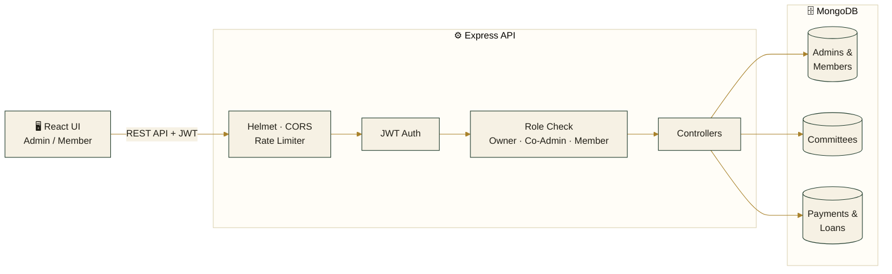

<div align="center">

# 🏛️ Committee Management

### A premium, bilingual BC / chit-fund committee platform — savings, loans, and members, all in one place.

[](https://committee-mgmt.vercel.app/)
[](https://react.dev/)
[](https://nodejs.org/)
[](https://www.mongodb.com/)
[](#license)

**[Live Demo](https://committee-mgmt.vercel.app/)** · **[Report a Bug](../../issues)** · **[Request a Feature](../../issues)**

</div>

<br />

<br />

## ✨ Why this project

In India, informal savings committees (BC / chit funds / samitis) are still run on paper registers and WhatsApp groups — easy to lose, hard to audit, and impossible to check from a phone at 11 PM. **Committee Management** replaces that register with a real, secure, bilingual web app: an admin runs the committee, members log in with just their phone number and a PIN, and every rupee — payments, loans, interest — is tracked, searchable, and exportable.

This isn't a CRUD toy project. It has real-world features most tutorials skip: role-based access with co-admins, a member-initiated PIN-reset flow, interest-bearing loan requests with an approval pipeline, printable statements that render correctly in **Hindi** (not garbled PDF text), and a session that auto-locks itself — because it's handling people's money.

## 🚀 Features

### For the Admin
- **Full committee control** — create a committee, set a default monthly contribution and loan interest rate, and manage rules
- **Co-admin invites** — generate an expiring invite code so a trusted second admin can help run the committee, without ever sharing the owner's login
- **Members register** — add, edit, search, and paginate members; each gets a unique phone + PIN login
- **Payments ledger** — a spreadsheet-style monthly grid per member, with inline editing and a one-click **"mark all paid"** for the current month
- **Loans, with interest** — give loans directly, or review and approve/reject loan **requests** members submit themselves; interest is calculated automatically
- **PIN-reset approvals** — when a member forgets their PIN, they submit a request the admin reviews and approves — no more manually resetting passwords over a phone call
- **Reports that actually work in Hindi** — a full payment register + loan ledger + summary, rendered as a real PDF (via an HTML→canvas pipeline, not a font hack), shareable straight to WhatsApp
- **One-click backup** — export the entire committee's members, loans, and payment history as JSON

### For the Member
- **Phone + PIN login** — no email, no app store, just their number and a 4-digit PIN
- **Self-service PIN change** and **editable phone number** — no need to bother the admin for routine things
- **Request a loan** — submit an amount and purpose; track its status as the admin reviews it
- **Printable yearly statement** — a clean, dated record of every payment and loan, one click away
- **See exactly where they stand** — total paid, outstanding loan balance, and payment history at a glance

### Platform-wide
- 🌐 **Bilingual (English / Hindi)** — a full custom i18n layer, not just translated labels; PDFs and CSVs export correctly in the selected language
- 🔒 **Real security, not decoration** — JWT auth, bcrypt-hashed PINs and passwords, `helmet`, rate-limited endpoints, a strict CORS allowlist, and role checks that distinguish *owner* from *co-admin* from *member* at the middleware level
- ⏱️ **Auto-logout on idle** — sessions lock themselves after inactivity, with a warning first
- 🔔 **Live activity + notifications**, confirm-before-delete dialogs, and toast feedback on every action
- 📱 **Fully responsive** — a proper mobile drawer nav, not a squeezed desktop layout

## 🧱 Tech Stack

| Layer | Technology |
|---|---|
| **Frontend** | React 19 · Vite · custom design-token system (no UI framework) · `jsPDF` + `html2canvas` for reports |
| **Backend** | Node.js · Express · MongoDB · Mongoose |
| **Auth & Security** | JWT · bcrypt · `helmet` · `express-rate-limit` · CORS allowlist |
| **Deployment** | Vercel (frontend) · Render/Railway (backend) |

## 🏗️ Architecture

The frontend never talks to MongoDB directly — every request goes through a layered Express API: rate-limiting and security headers first, then JWT auth, then a role check (**owner** vs **co-admin** vs **member**) before it ever reaches a controller.



**Why this shape matters:** a co-admin can manage members and loans, but only the *owner* can revoke an invite or delete the committee — that distinction is enforced once, in the **Role Check** step, not re-checked in every controller. It's also why a member's PIN-reset request has to be approved by an admin instead of resetting itself: the write path for anything security-sensitive always passes through a human on the other side of that check.

The frontend itself is deployed on **Vercel**, the API on **Render/Railway**, and the database on **MongoDB Atlas** — three independent, horizontally-scalable pieces rather than one monolith.

## 📸 Screenshots

> Replace the placeholders in `/docs` with real screenshots (Dashboard, Payments grid, Loan approval, Hindi mode, mobile view) before sharing this repo — recruiters open the README before they open the code.

## 🏁 Getting Started

### Prerequisites
- Node.js 18+
- A MongoDB connection string (local or [Atlas](https://www.mongodb.com/cloud/atlas))

### 1. Clone the repo
```bash
git clone https://github.com/<your-username>/committee-mgmt.git
cd committee-mgmt
```

### 2. Backend
```bash
cd backend
npm install
cp .env.example .env   # fill in MONGODB_URI, JWT_SECRET, CORS_ORIGIN, etc.
npm run dev
```

### 3. Frontend
```bash
cd frontend
npm install
cp .env.example .env   # set VITE_API_BASE_URL to your backend URL
npm run dev
```

The app runs at `http://localhost:5173` by default, talking to the API at `http://localhost:5000/api`.

## 🗂️ Project Structure

```
committee-mgmt/
├── backend/
│   ├── controllers/     # request handlers — auth, members, payments, loans, co-admins, PIN resets
│   ├── middleware/       # JWT auth, RBAC (owner/co-admin/member), rate limiting
│   ├── models/           # Mongoose schemas
│   └── routes/
└── frontend/
    ├── src/
    │   ├── pages/         # Dashboard, Members, Payments, Loans, Settings
    │   ├── components/    # shared UI (cards, modals, toasts, layout)
    │   ├── i18n/           # English/Hindi translation system
    │   └── utils/          # PDF report generation, CSV export
```

## 🗺️ Roadmap

- [ ] Admin password-reset flow (currently PIN-reset is member-only)
- [ ] SMS/email reminders for pending monthly payments
- [ ] Automated end-to-end test suite

## 🤝 Contributing

This is primarily a personal/portfolio project, but issues and suggestions are welcome — feel free to open one.

## 📄 License

Distributed under the MIT License. See `LICENSE` for details.

## 👤 Author

**Shakibuddin**
Computer Science Engineering student, IES College of Technology, Bhopal

- LinkedIn: [shakib-uddin](https://in.linkedin.com/in/shakib-uddin-36865b240)
- Email: shakibu015@gmail.com

<div align="center">
  <sub>Built to replace a paper register with something a committee can actually trust.</sub>
</div>
